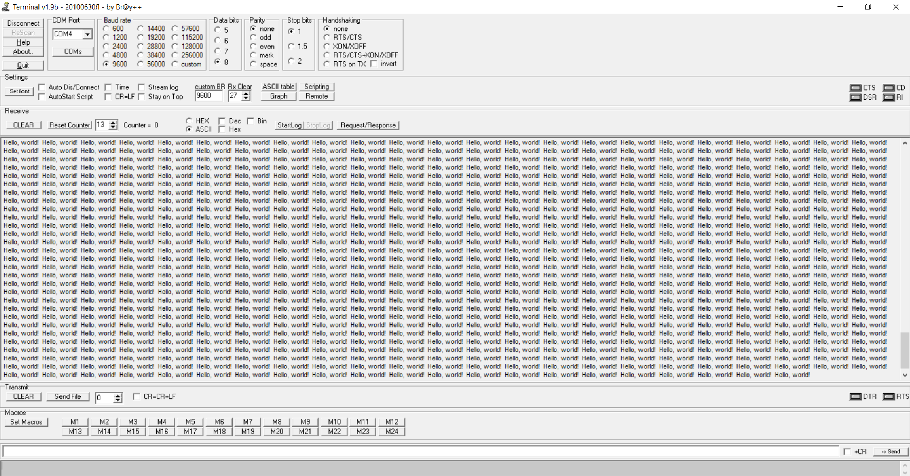

==  UART в IAR Embedded Workbench

---

=== *Выполнение работы:*

После стандартной предварительной настройки необходимо включить *UART* в проекте.
Получаем такую поселодвательность:

1) Подключаем *UART* к источнику тактирования:

[source, cpp]
----
 RCC::APB1ENR::USART2EN::Enable::Set();
----

2)Вопользовавшись *datasheet*, настроитм порты на альтернативную
функцию модуля *UART* и настраиваем саму функцию портов _A2_ и _A3_  на прием и передачу.

[source, cpp]
----
  GPIOA::MODER::MODER2::Alternate::Set();
  GPIOA::MODER::MODER3::Alternate::Set();
  GPIOA::AFRL::AFRL2::Af7::Set();
  GPIOA::AFRL::AFRL3::Af7::Set();

----

3)После настроим порты в режим двухтактный выход + подтяжку к 1:

[source, cpp]
----
  GPIOA::OTYPER::OT2::OutputPushPull::Set();
  GPIOA::OTYPER::OT3::OutputPushPull::Set();
  GPIOA::PUPDR::PUPDR2::PullUp::Set();
  GPIOA::PUPDR::PUPDR3::PullUp::Set();
----

4)Произведем настройку регистров управления *CR1*, здесь устанавливается режим дискретизации, длина символа, один стоп и один старт бит:

[source, cpp]
----
    USART2::CR1::OVER8::OversamplingBy16::Set();
    USART2::CR1::M::Data8bits::Set();
    USART2::CR2::STOP::Value0::Set(); //1 ñòîï áèò
    USART2::CR1::PCE::ParityControlDisable::Set();
----
5)Из  *datasheet* возьем формулу для расчета скорсти передачи данных и установим её равной _9600_ бит/c:

[source, cpp]
----
  uint32_t USART_DIV=16'000'000/(BaudRate*8*(2 - USART2::CR1::OVER8::Get()));
  USART2::BRR::DIV_Mantissa::Set(USART_DIV);
----

6)Теперь включим *UART* и разрешим передачу данных.

[source, cpp]
----
    USART2::CR1::UE::Enable::Set();
    USART2::CR1::TE::Enable::Set();
----

После произведенеия данных настроек передадим в программу *Terminal* на ПК предложение _Hello world!_,
для проверки работоспособности программы. предложение хранится в буфере и каждый его символ передается последовательно.

Ниже представлено окно программы *Terminal* во время передачи данных:

Код программы:

[source, cpp]
----
#include <cstdint>            //for int types such as uint32_t
#include "gpioaregisters.hpp" //for Gpioa
#include "gpiocregisters.hpp" //for Gpioc
#include "gpiobregisters.hpp" //for Gpiob
#include "rccregisters.hpp"   //for RCC
#include "tim2registers.hpp"   //for SPI2
#include "nvicregisters.hpp"  //for NVIC
#include "adc1registers.hpp"
#include "adccommonregisters.hpp"
#include "usart2registers.hpp"
#include <iostream>

extern "C"
{
  constexpr uint32_t BaudRate=9600;
  int __low_level_init(void)
  {
    //config
    RCC::CR::HSEON::On::Set();
    while (!RCC::CR::HSERDY::Ready::IsSet())
    { }
    RCC::CFGR::SW::Hse::Set();
    while (!RCC::CFGR::SWS::Hse::IsSet())
    { }
    RCC::CR::HSION::Off::Set();
    RCC::AHB1ENR::GPIOAEN::Enable::Set();
    RCC::AHB1ENR::GPIOCEN::Enable::Set();
    GPIOA::MODER::MODER0::Analog::Set();
    GPIOC::MODER::MODER5::Output::Set();
    GPIOA::MODER::MODER5::Output::Set();
    GPIOC::MODER::MODER9::Output::Set();
    GPIOC::MODER::MODER8::Output::Set();
    GPIOA::MODER::MODER2::Alternate::Set();
    GPIOA::MODER::MODER3::Alternate::Set();
    GPIOA::OTYPER::OT2::OutputPushPull::Set();
    GPIOA::OTYPER::OT3::OutputPushPull::Set();
    GPIOA::PUPDR::PUPDR2::PullUp::Set();
    GPIOA::PUPDR::PUPDR3::PullUp::Set();
    GPIOA::AFRL::AFRL2::Af7::Set();
    GPIOA::AFRL::AFRL3::Af7::Set();

     //UART
    RCC::APB1ENR::USART2EN::Enable::Set();//ïîäà÷à òàêòèðîâàíèÿ
    USART2::CR1::M::Data8bits::Set();
    USART2::CR1::PCE::ParityControlDisable::Set();
    USART2::CR1::OVER8::OversamplingBy16::Set();
    USART2::CR2::STOP::Value0::Set(); //1 ñòîï áèò
    //USARTDIV = CLK/(BaudRate*8*(2 - OVER8))?
    USART2::CR1::UE::Enable::Set(); //Âêëþ÷åíèå USART
    USART2::CR1::TE::Enable::Set(); //Âêëþ÷åíèå ïåðåäà÷è
    uint32_t USART_DIV = 16'000'000/(BaudRate*8*(2 - USART2::CR1::OVER8::Get()));
    USART2::BRR::DIV_Mantissa::Set(USART_DIV);

    return 1;
  }
}

int main()
{
  char buff[] = " Hello, world! ";

  for(;;)
  {
    for(int i=0; i<strlen(buff); i++)
    {
      USART2::DR::Write(buff[i]);
      while(!USART2::SR::TXE::DataRegisterEmpty::IsSet())
            {
            }
    }

  }

}

----